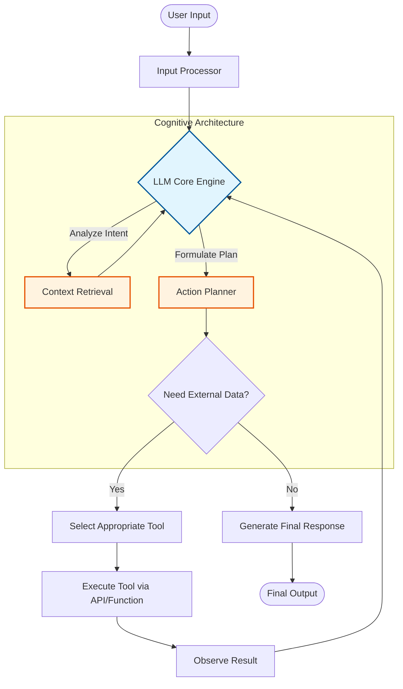

# 1️⃣ The Foundation Agent

Welcome to the ground floor. Before we can give an agent tools or a team, we need to understand what an agent actually is.

---

## 🧠 LLMs vs. Agents
*   **LLM (Model)**: A text-prediction engine. You give it a prompt, it returns the most statistically likely completion.
*   **Agent**: A system that uses an LLM as its *reasoning engine*. It perceives its environment, makes decisions, and takes autonomous actions.

## 🔁 The Core Agent Loop
Under the hood, almost every agent framework (LangChain, ADK, AutoGPT) runs a variation of this fundamental loop:



## 💻 In This Lab
We are building a barebones agent. It has no tools yet, so it will always choose "No" in the flowchart above. 

We are defining:
1. The **Model** (`gemini-2.5-flash`)
2. The **Persona / Instruction** ("You are a helpful assistant...")

### 🚀 How to Run (Interactive UI)
Instead of a boring terminal, we will use the ADK's built-in Web Server to get a ChatGPT-like interface!

From the `labs` directory, run:
```bash
adk web 01_beginner/01_foundation_agent
```
Then open **`http://localhost:8000`** in your browser.
