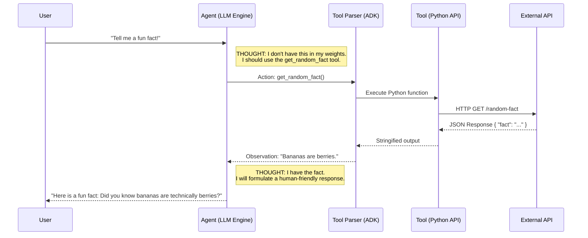

# 2️⃣ Empowering with Tools

An agent without tools is just a chatbot trapped in a box. It cannot browse the internet, check a database, or execute math reliably.

Let's give it hands.

---

## 🛠️ The ReAct Framework (Reasoning + Acting)
To use a tool, the agent must execute a specific cognitive pattern known as **ReAct**. It forces the LLM to write out its thoughts before acting.



## 💻 In This Lab
We are moving beyond text prediction to **Function Calling**. 
1. We define a **mock** Python function `get_weather` (simulated data).
2. We define a **real** Python function `get_random_fact` that calls a live internet API!
3. We wrap them in ADK's `FunctionTool`.
4. The LLM's reasoning engine will autonomously detect when it needs to call these functions based on the user's prompt.

> **💡 Mock vs. Real:** `get_weather` returns hardcoded data — great for learning without internet issues. `get_random_fact` calls a live API — this is the "wow" moment where you see your agent reach out to the real world!

### 🚀 How to Run (Interactive UI)
From the `labs` directory, run:
```bash
adk web 01_beginner/02_tools_agent
```
1. Open **`http://localhost:8000`** in your browser.
2. Ask about the weather in London or Tokyo (mock tool).
3. Ask: *"Tell me a fun fact!"* (real live API call! 🎲)
4. Click the **"Inspector"** tab in the top right of the UI to see the hidden API calls happen live!

### 📝 Prompt Engineering Tips
The quality of your agent depends heavily on the **instruction** you write. Here are some tips:
- **Be specific about roles:** "You are a weather expert" beats "You are helpful"
- **Explain when to use tools:** "Use `get_weather` when users ask about weather" 
- **Add constraints:** "Never make up data. If you don't know, say so."
- **Describe output format:** "After using a tool, explain the result in plain language"
