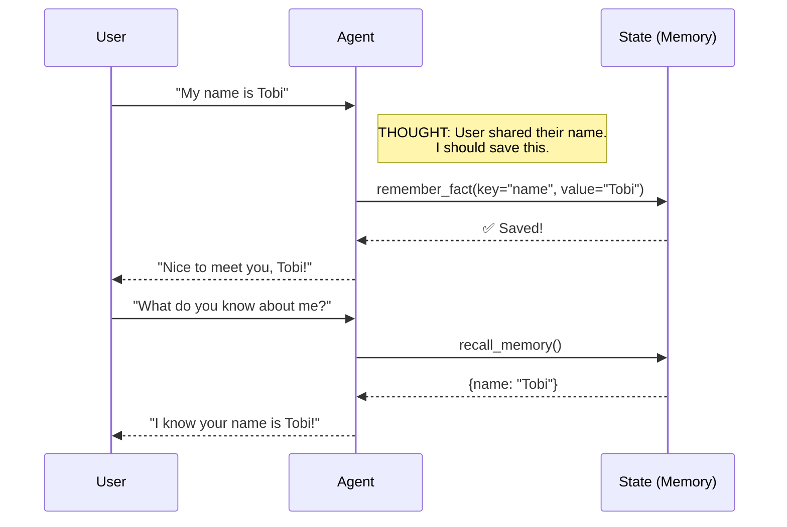

# 🧠 Session State: Giving Your Agent Memory

Without memory, an agent is just a goldfish — it forgets everything between turns. **Session State** is what separates a real agent from a fancy chatbot.

---

## 📦 What is Session State?

In ADK, every conversation happens inside a **Session**. Each session has a **state** dictionary that persists across all turns of the conversation.



## 🔑 The Key Concept: `ToolContext`

When you add `tool_context: ToolContext` as a parameter to any tool function, ADK **automatically injects** the current session's context. You don't pass it yourself — the framework handles it.

```python
from google.adk.tools import ToolContext

def my_tool(some_input: str, tool_context: ToolContext) -> str:
    # READ from state
    name = tool_context.state.get("name", "stranger")
    
    # WRITE to state
    tool_context.state["last_query"] = some_input
    
    return f"Hello, {name}!"
```

## 💻 In This Lab

We build a personal assistant that:
1. **Remembers** facts you tell it (name, hobbies, city, etc.)
2. **Recalls** everything it knows about you on demand
3. **References** your saved info naturally in conversation

### 🚀 How to Run (Interactive UI)
From the `labs` directory, run:
```bash
adk web 02_advanced/02a_stateful_agent
```
1. Open **`http://localhost:8000`** in your browser.
2. Tell it your name, your favorite food, your course of study.
3. Then ask: *"What do you know about me?"*
4. Watch the **Inspector Tab** to see state being read and written in real time!

### 💡 Why This Matters

In production, session state is how agents track:
- Shopping carts 🛒
- User preferences ⚙️
- Multi-step form progress 📝
- Conversation context that the LLM would otherwise forget
