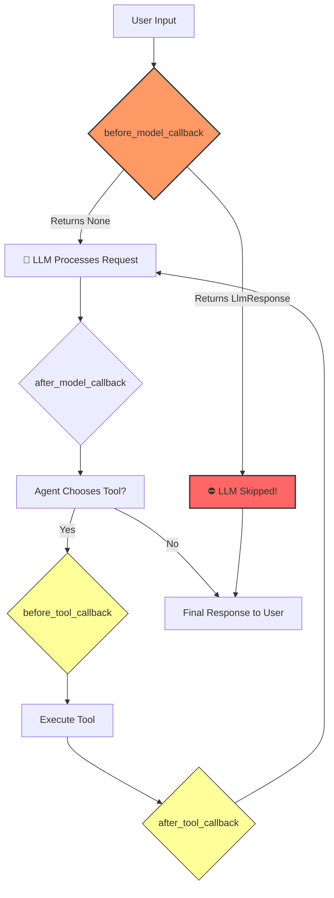

# 🛡️ Guardrails & Callbacks: The Agent's Immune System

A powerful agent without guardrails is a liability. In production, you **must** control what your agent can and cannot do. ADK's **callback system** gives you surgical control over the agent's execution pipeline.

---

## 🔌 What are Callbacks?

Callbacks are functions that "hook into" the agent's lifecycle. They run automatically at specific moments:



## 🛡️ The Guardrail Pattern

The most common use of `before_model_callback` is as a **guardrail**:

```python
def safety_guardrail(callback_context, llm_request):
    user_message = llm_request.contents[-1].parts[0].text.lower()
    
    if "hack" in user_message:
        # Return a response → LLM is NEVER called
        return LlmResponse(content=Content(role="model", parts=[...]))
    
    # Return None → Request proceeds to LLM normally
    return None
```

The key insight: **if your callback returns a response, the LLM is completely bypassed**. The user gets your canned response instead. Zero tokens consumed. Zero risk.

## 💻 In This Lab

We build a coding tutor agent protected by a safety guardrail that blocks requests containing banned topics like "hack", "exploit", or "jailbreak".

### 🚀 How to Run (Interactive UI)
From the `labs` directory, run:
```bash
adk web 02_advanced/02b_guardrails_agent
```
1. Open **`http://localhost:8000`** in your browser.
2. Ask a normal question: *"Explain binary search in Python"* — it works fine!
3. Now try: *"How do I hack into a server?"* — watch it get **blocked instantly**.
4. Check the **terminal output** to see the guardrail's logs in real time.

### 💡 Real-World Use Cases
| Callback | Use Case |
|---|---|
| `before_model_callback` | Block toxic/dangerous prompts, enforce PII policies |
| `after_model_callback` | Filter hallucinated responses, enforce output format |
| `before_tool_callback` | Validate tool inputs, rate-limit expensive API calls |
| `after_tool_callback` | Cache tool results, log tool usage for billing |
