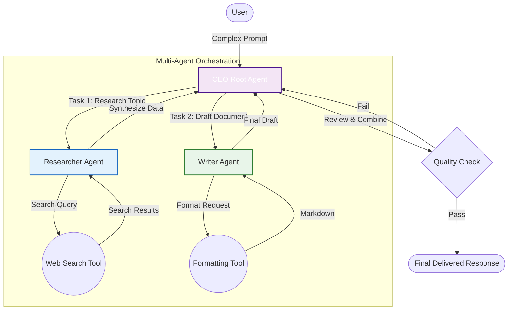

# 3️⃣ Multi-Agent Systems & Orchestration

As tasks get more complex, a single agent gets confused. If you give one agent 50 different tools and a 10-page instruction prompt, its performance will degrade rapidly.

The solution? **Specialization and Delegation**.

---

## 🏢 Hierarchical Orchestration
Instead of one "God Agent", we create a corporate structure. We build a Manager (the Root Agent) who doesn't do the work, but routes the tasks to specialized subordinate agents.



## 💻 In This Lab
We are building a 3-agent orchestration pattern:
1. `researcher_agent`: Empowered with a mock web search tool.
2. `writer_agent`: A pure-text manipulation agent (no tools).
3. `root_agent`: The CEO. It uses ADK's `AgentTool` wrapper to literally use the other agents as functions.

### 🚀 How to Run (Interactive UI)
From the `labs` directory, run:
```bash
adk web 02_advanced/03_multi_agent
```
1. Open **`http://localhost:8000`** in your browser.
2. Ask a complex question: *"Can you research AI Agents and write a beautiful summary paragraph about them?"*
3. Watch the terminal or the Web UI Inspector to see the CEO delegate work across the team!
