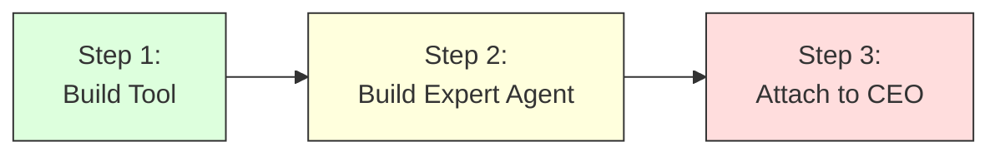

# 🏗️ Capstone Challenge: Build Your Own Agent Team

Welcome to the sandbox! It's time to take off the training wheels and build something uniquely yours.

---

## 🎯 The Objective
You have learned how to create single agents, empower them with Python functions (`FunctionTool`), and orchestrate them into multi-agent teams (`AgentTool`). 

Your challenge is to combine these concepts to build a **Custom Agent System** that solves a real problem.

## 📝 The Blueprint
You will open `agent.py` and fill in the missing `# TODO:` sections.



1. **Write a custom python tool**: Think of something cool (e.g., fetching a stock price, generating a random OAU student persona, simulating a dice roll).
2. **Create an expert sub-agent**: Give it a strict persona and attach your new tool.
3. **Add your new sub-agent to the `root_agent`'s team**.
4. **Modify the `instruction`**: Ensure the `root_agent` knows how to use your new team member!

## 🚀 How to Run
```bash
adk web 03_capstone/04_custom_agent_challenge
```
*Test it out and prepare to share your team's architecture with the room!*
