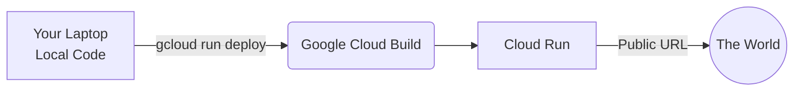

# 🚀 Deploying Your Agent

Building agents locally is fun, but deploying them so the world can talk to them is how you build a real product.

Because we are using **Vertex AI**, the easiest way to deploy our agent is using **Google Cloud Run**.

---

## ☁️ Why Cloud Run?
Cloud Run takes a Docker container and automatically deploys it as a scalable, serverless web app. It will give your `adk web` chat interface a public `https://...` URL instantly.



## 🛠️ Step-by-Step Deployment

1. **Open your terminal** and ensure you are in the `labs/` directory of this repository. (This is where our `Dockerfile` is located).
   ```bash
   cd Building-AI-Agents/labs
   ```

2. **Authenticate your CLI** (if you haven't already):
   ```bash
   gcloud auth login
   ```

3. **Deploy to Cloud Run**:
   Run the following command. It tells Google Cloud to build the `Dockerfile` and deploy it.
   ```bash
   gcloud run deploy my-ai-agent \
     --source . \
     --region us-central1 \
     --allow-unauthenticated \
     --set-env-vars=GOOGLE_GENAI_USE_VERTEXAI=1,GOOGLE_CLOUD_PROJECT=YOUR_PROJECT_ID,GOOGLE_CLOUD_LOCATION=us-central1
   ```
   *(Make sure to replace `YOUR_PROJECT_ID` with your actual project ID!)*

4. **Wait 2 Minutes**: Google Cloud will build the container and deploy it. 
5. **Get your URL**: When it finishes, it will print a `Service URL`. Click it to talk to your live agent!

---
*Note: The included `Dockerfile` is configured to deploy the `04_custom_agent_challenge` agent. If you want to deploy a different agent, modify the `CMD` line in the `Dockerfile`.*
